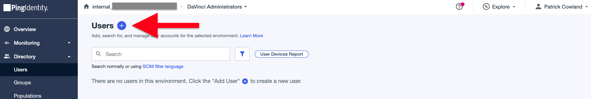
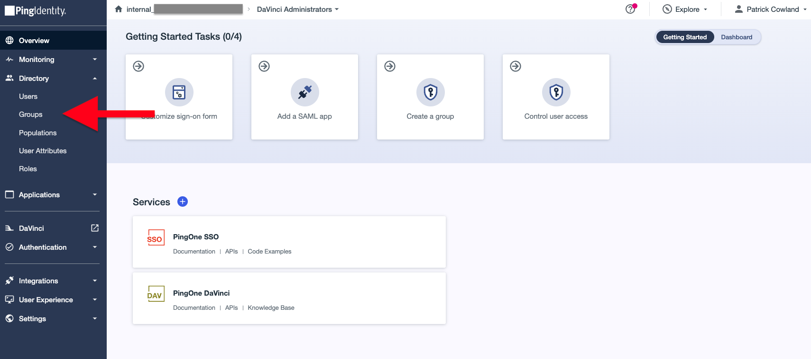
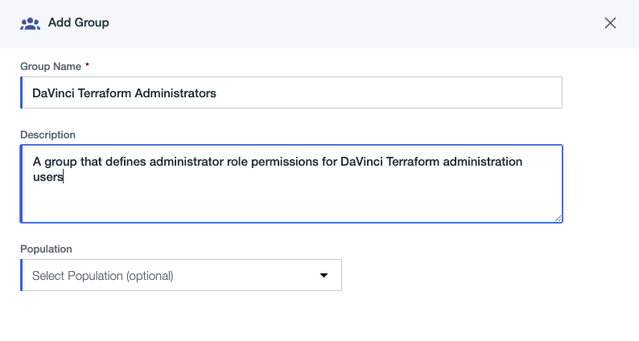
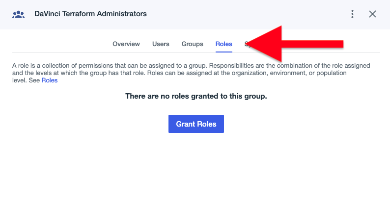

# Getting Started - PingOne DaVinci

    
    
        <a class="assetlinks" href="https://registry.terraform.io/providers/pingidentity/davinci/latest" target=”_blank”>Registry</a>
    

## Requirements

* Terraform CLI 1.1+
* A licensed or trial PingOne cloud subscription - [Try Ping here](https://www.pingidentity.com/en/try-ping.html)
* Administrator access to the [PingOne Administration Console](https://docs.pingidentity.com/r/en-us/pingone/p1_access_admin_console)
* The PingOne DaVinci service enabled in the subscription. [Check PingOne DaVinci is enabled](https://pingidentity.github.io/terraform-docs/getting-started/davinci/#the-pingone-davinci-service-license).

## The PingOne DaVinci Service License

The PingOne DaVinci service is not enabled by default in the PingOne Cloud Platform trial, or with licenses that do not explicitly include the DaVinci service.  When configuring environments using the PingOne provider, the DaVinci service will not be available unless the service has been enabled.

!!! note "Enable the DaVinci service"
    * If you have an existing Ping Identity license and would like to try PingOne DaVinci, please contact your Ping Identity account manager.
    * If you have registered for a trial account and would like to try PingOne DaVinci, or have questions about Ping Identity solutions, please [contact sales](https://www.pingidentity.com/en/company/contact-sales.html).

More information about PingOne solutions can be found [here](https://docs.pingidentity.com/r/en-us/pingone/pingone_p1solutions_main).

You can check whether DaVinci is enabled through the PingOne Administration Console:

1. First, log in to the **PingOne Administration** Console using your unique admin sign-on link.
2. Once signed in, click **Add Environment**.
    

      
Expand Screenshot

        
    

3. Click **Build your own solution**.
4. Check that **PingOne DaVinci** is in the list of available services.
    

      
Expand Screenshot

        
    

## Configure PingOne for Terraform access

The following steps describe how to connect Terraform to your PingOne instance:

1. Log in to your **PingOne Administration Console**. On registration for a trial, a link will be sent to your provided email address.
2. Create a new environment for DaVinci administration users by clicking the **Add Environment** button.
    

      
Expand Screenshot

        
    

3. Ensure **Build your own solution** is selected, and then select **PingOne SSO** and **PingOne DaVinci** services and click **Next**.
    

      
Expand Screenshot

        
    

4. Proceed through to the new environment form.  Enter a name, an optional description, an environment type, region and license as shown.
    

      
Expand Screenshot

        
    

5. Open the newly created environment and follow the **Manage Environment** button link.
6. Navigate to the **Users** link in the left menu, by expanding the **Directory** section.
    

      
Expand Screenshot

        
    

7. Add a new User with the **+** icon.
    

      
Expand Screenshot

        
    

8. Set a name, a username, email, population and a temporary password.  The email mailbox for the provided email should be accessible, as the email will need to be verified with a one time code.  The screenshot shows an optional "+terraform" notation in the email address, as supported by some email vendors.  This is not required for Terraform use.
    

      
Expand Screenshot

        
    

9. Enable the user with the toggle switch.
    

      
Expand Screenshot

        
    

10. Navigate to the **Groups** link in the left menu, by expanding the **Directory** section.
    

      
Expand Screenshot

        
    

11. Add a new Group with the **+** icon.
    

      
Expand Screenshot

        
    

12. Create a group that will define role permissions for DaVinci Terraform administration.  Set a name, an optional description and an optional population assignment.
    

      
Expand Screenshot

        
    

13. After the group has been created, select the **Roles** tab to manage the associated administrator roles.
    

      
Expand Screenshot

        
    

14. Click the **Grant Roles** button link, and proceed to assign the **DaVinci Admin** role to the group.  For most customer tenants, it is best practice to scope the admin role to individual environments.  In this case, select the current environment that the group is being created in (in the screenshot example, this is the **DaVinci Administrators** environment).  For organization tenants that do not carry production data (such as demo/trial environments), the DaVinci role may be scoped to the organization for simplicity.  See the [Role Permissions for New Environments](#role-permissions-for-new-environments) section for more details.
    

      
Expand Screenshot

        
    

15. Save the role assignment.
16. Navigate to the **Authentication Policies** page.
    

      
Expand Screenshot

        
    

17. Ensure that the **Single_Factor** policy is set as the environment default.  This policy should have **Login** as the only policy action.
    

      
Expand Screenshot

        
    

18. Navigate to the **Environment Properties** page.
    

      
Expand Screenshot

        
    

19. Save the **Environment ID** value.  The environment ID will be used to authenticate the DaVinci Terraform provider.
    

      
Expand Screenshot

        
    

20. Open the **Self-Service URL** link in a private browser window.
    

      
Expand Screenshot

        
    

21. Enter the username and temporary password for the newly created user from step 8 and proceed to sign on.
    

      
Expand Screenshot

        
    

22. When prompted, proceed to change the password to a strong password of choice.  This new password will be used to authenticate the DaVinci Terraform provider.
23. After successfully authenticating, retrieve the verification code sent to the created user's email inbox, and enter the verification code in the prompt.
    

      
Expand Screenshot

        
    

24. On successful email verification, the account will be ready to use.  Close the Self-Service private browser window.
25. Steps to configure the DaVinci Terraform provider using the created user's username and password values, along with the environment ID from step 14, can be found on the [Terraform Registry provider documentation](https://registry.terraform.io/providers/pingidentity/davinci/latest/docs).

## Role Permissions for New Environments

When creating new environments, either through the PingOne Administration Console or through the [PingOne Terraform provider](https://registry.terraform.io/providers/pingidentity/pingone/latest/docs/resources/environment), role permissions must be set on the DaVinci administrator group created above.

The DaVinci administration user must have the following role:

* **DaVinci Admin**, scoped to the organization (to capture all new created environments), or scoped to each new environment that the DaVinci Terraform provider should manage.

!!! warning "Role Combination Change"
    As of 15th August 2023, the existing role combination of **Environment Admin** and **Identity Data Admin** to manage DaVinci configuration was replaced with the **DaVinci Admin** role.  See [Frequently Asked Questions - DaVinci](https://terraform.pingidentity.com/faq/davinci/#ive-enabled-davinci-on-my-environment-with-terraform-but-the-environment-isnt-listed-in-the-davinci-admin-console) for more information.

See [PingOne Role Permission Assignment](../../examples/pingone/role-assignment/) for an example of assigning roles using the PingOne Terraform provider.
