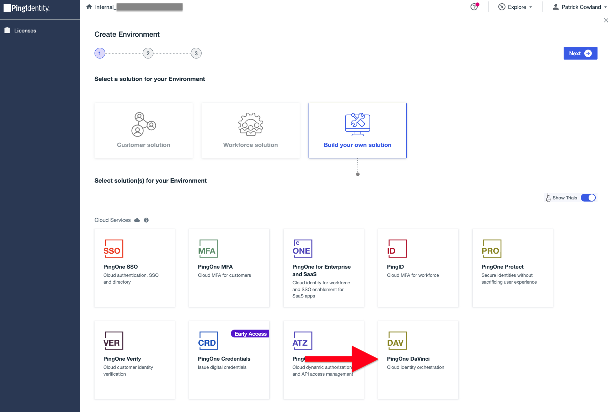

# Getting Started - PingOne DaVinci

<div class="banner" onclick="window.open('https://registry.terraform.io/providers/pingidentity/davinci/latest','');">
    
    <span class="caption">
        <a class="assetlinks" href="https://registry.terraform.io/providers/pingidentity/davinci/latest" target=”_blank”>Registry</a>
    </span>
</div>

## Requirements

* Terraform CLI 1.1+
* A licensed or trial PingOne cloud subscription - [Try Ping here](https://www.pingidentity.com/en/try-ping.html)
* Administrator access to the [PingOne Administration Console](https://docs.pingidentity.com/r/en-us/pingone/p1_access_admin_console)
* The PingOne DaVinci service enabled in the subscription. [Check PingOne DaVinci is enabled](https://pingidentity.github.io/terraform-docs/getting-started/davinci/#the-pingone-davinci-service-license).

## The PingOne DaVinci Service License

The PingOne DaVinci service is not enabled by default in the PingOne Cloud Platform trial, or with licenses that do not explicitly include the DaVinci service.  When configuring environments using the PingOne provider, the DaVinci service will not be available unless the service has been enabled.

!!! note "Enable the DaVinci service"
    * If you have an existing Ping Identity license and would like to try PingOne DaVinci, please contact your Ping Identity account manager.
    * If you have registered for a trial account and would like to try PingOne DaVinci, or have questions about Ping Identity solutions, please [contact sales](https://www.pingidentity.com/en/company/contact-sales.html).

More information about PingOne solutions can be found [here](https://docs.pingidentity.com/r/en-us/pingone/pingone_p1solutions_main).

You can check whether DaVinci is enabled through the PingOne Administration Console:

1. First, log in to the **PingOne Administration** Console using your unique link.
2. Once signed in, click **Add Environment**.
    <details>
      <summary>Expand Screenshot</summary>
        
    </details>
3. Click **Build your own solution**.
4. Check that **PingOne DaVinci** is in the list of available services.
    <details>
      <summary>Expand Screenshot</summary>
        
    </details>

## Configure PingOne for Terraform access

The following steps describe how to connect Terraform to your PingOne instance:

1. Log in to your **PingOne Administration Console**. On registration for a trial, a link will be sent to your provided email address.
2. Create a new environment for DaVinci administration users by clicking the **Add Environment** button.
    <details>
      <summary>Expand Screenshot</summary>
        
    </details>
3. Ensure **Build your own solution** is selected, and then select **PingOne SSO** and **PingOne DaVinci** services and click **Next**.
    <details>
      <summary>Expand Screenshot</summary>
        
    </details>
4. Proceed through to the new environment form.  Enter a name, an optional description, an environment type, region and license as shown.
    <details>
      <summary>Expand Screenshot</summary>
        
    </details>
5. Open the newly created environment.
6. Navigate to the **Users** link.
    <details>
      <summary>Expand Screenshot</summary>
        
    </details>
7. Add a new User with the **+** icon.
    <details>
      <summary>Expand Screenshot</summary>
        
    </details>
8. Set a name, a username, email, population and a temporary password.  The email mailbox for the provided email should be accessible, as the email will need to be verified with a one time code.  The screenshot shows an optional "+terraform" notation in the email address, as supported by some email vendors.  This is not required for Terraform use.
    <details>
      <summary>Expand Screenshot</summary>
        
    </details>
9. Enable the user with the toggle switch.
    <details>
      <summary>Expand Screenshot</summary>
        
    </details>
10. Click on the **Roles** tab, and set administrative roles accordingly.  Example roles to be able to manage configuration are shown in the below screenshot.  More information about role permissions that are required for the DaVinci provider are described in the [Role Permissions for New Environments](#role-permissions-for-new-environments) section below.
    <details>
      <summary>Expand Screenshot</summary>
        
    </details>
11. Navigate to the **Authentication Policies** page.
    <details>
      <summary>Expand Screenshot</summary>
        
    </details>
12. Ensure that the **Single_Factor** policy is set as the environment default.  This policy should have **Login** as the only policy action.
    <details>
      <summary>Expand Screenshot</summary>
        
    </details>
13. Navigate to the **Environment Properties** page.
    <details>
      <summary>Expand Screenshot</summary>
        
    </details>
14. Save the **Environment ID** value.  The environment ID will be used to authenticate the DaVinci Terraform provider.
    <details>
      <summary>Expand Screenshot</summary>
        
    </details>
15. Open the **Self-Service URL** link in a private browser window.
    <details>
      <summary>Expand Screenshot</summary>
        
    </details>
16. Enter the username and temporary password for the newly created user from step 8 and proceed to sign on.
    <details>
      <summary>Expand Screenshot</summary>
        
    </details>
17. When prompted, proceed to change the password to a strong password of choice.  This new password will be used to authenticate the DaVinci Terraform provider.
18. After successfully authenticating, retrieve the verification code sent to the created user's email inbox, and enter the verification code in the prompt.
    <details>
      <summary>Expand Screenshot</summary>
        
    </details>
19. On successful email verification, the account will be ready to use.  Close the Self-Service private browser window.
20. Steps to configure the DaVinci Terraform provider using the created user's username and password values, along with the environment ID from step 14, can be found on the [Terraform Registry provider documentation](https://registry.terraform.io/providers/pingidentity/davinci/latest/docs).

## Role Permissions for New Environments

When creating new environments, either through the PingOne Administration Console or through the [PingOne Terraform provider](https://registry.terraform.io/providers/pingidentity/pingone/latest/docs/resources/environment), role permissions must be set on the DaVinci administration user created above.

The DaVinci administration user must have the following roles:

* **Environment Admin**, scoped to the organization (to capture all new created environments), or scoped to each new environment that the DaVinci Terraform provider should manage.
* **Identity Data Admin**, scoped to each new environment that the DaVinci Terraform provider should manage.
* **Organization Admin**, scoped to the organization.

### Example Role Permission Assignment in Terraform

The following shows an example of environment creation using the PingOne Terraform provider, followed by role permission assignment required by the DaVinci administration user.  The example assumes that the user (whose username is stored in the `var.pingone_dv_admin_username` variable and exists in an environment whose ID is stored in `var.pingone_admin_environment_id`), has the following role assignments:

* **Environment Admin**, scoped to individual environments (not scoped to the organization)
* **Identity Data Admin**, scoped to individual environments (not scoped to the organization)
* **Organization Admin**, scoped to the organization.

First, we define the environment with the [PingOne Terraform provider](https://pingidentity.github.io/terraform-docs/getting-started/pingone/) with the `pingone_environment`<a href="https://registry.terraform.io/providers/pingidentity/pingone/latest/docs/resources/environment" target="_blank">:octicons-link-external-16:</a> resource, with the DaVinci service enabled:
``` terraform
resource "pingone_environment" "my_environment" {
  name        = "DaVinci Enabled Environment"
  type        = "SANDBOX"
  license_id  = var.license_id

  default_population {}

  service {
    type = "SSO"
  }

  service {
    type = "DaVinci"
  }
}
```

We then fetch the required roles using the `pingone_role`<a href="https://registry.terraform.io/providers/pingidentity/pingone/latest/docs/data-sources/role" target="_blank">:octicons-link-external-16:</a> data source, so we can use their IDs in role assignment:
``` terraform
data "pingone_role" "identity_data_admin" {
  name = "Identity Data Admin"
}

data "pingone_role" "environment_admin" {
  name = "Environment Admin"
}
```

We fetch the DaVinci administration user using the `pingone_user`<a href="https://registry.terraform.io/providers/pingidentity/pingone/latest/docs/data-sources/user" target="_blank">:octicons-link-external-16:</a> data source, so we can use their ID in role assignment.
``` terraform
data "pingone_user" "dv_admin_user" {
  environment_id = var.pingone_admin_environment_id

  username = var.pingone_dv_admin_username
}
```

Lastly, we assign the roles to the DaVinci administration user with the `pingone_role_assignment_user`<a href="https://registry.terraform.io/providers/pingidentity/pingone/latest/docs/resources/role_assignment_user" target="_blank">:octicons-link-external-16:</a> resource.
``` terraform
resource "pingone_role_assignment_user" "admin_sso_identity_admin" {
  environment_id       = var.pingone_admin_environment_id
  user_id              = data.pingone_user.dv_admin_user.id
  role_id              = data.pingone_role.identity_data_admin.id
  scope_environment_id = pingone_environment.my_environment.id
}

resource "pingone_role_assignment_user" "admin_sso_environment_admin" {
  environment_id       = var.pingone_admin_environment_id
  user_id              = data.pingone_user.dv_admin_user.id
  role_id              = data.pingone_role.environment_admin.id
  scope_environment_id = pingone_environment.my_environment.id
}
```

Once the roles are assigned, the DaVinci administration user is able to make administrative changes to the DaVinci configuration in the new environment.