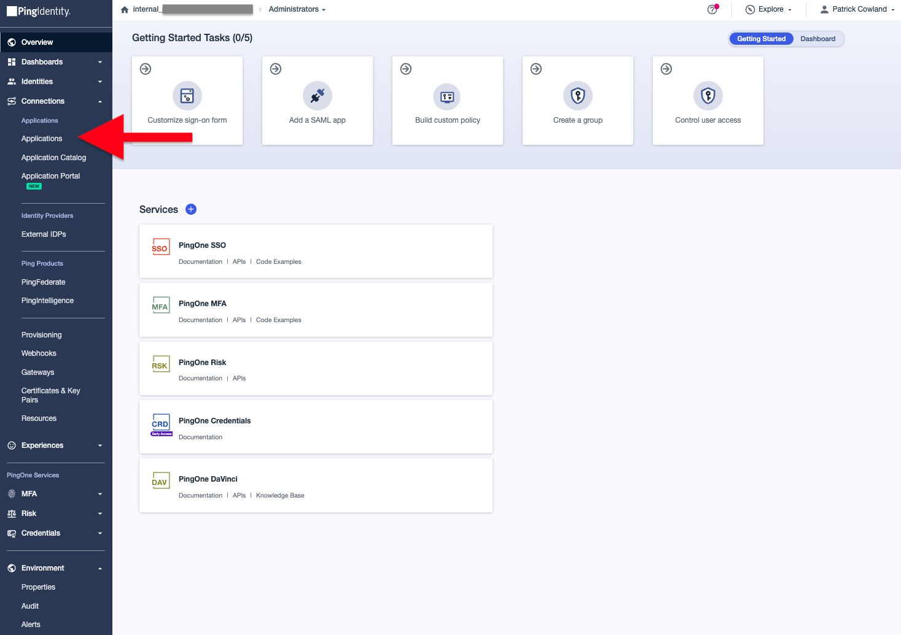
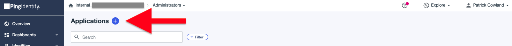
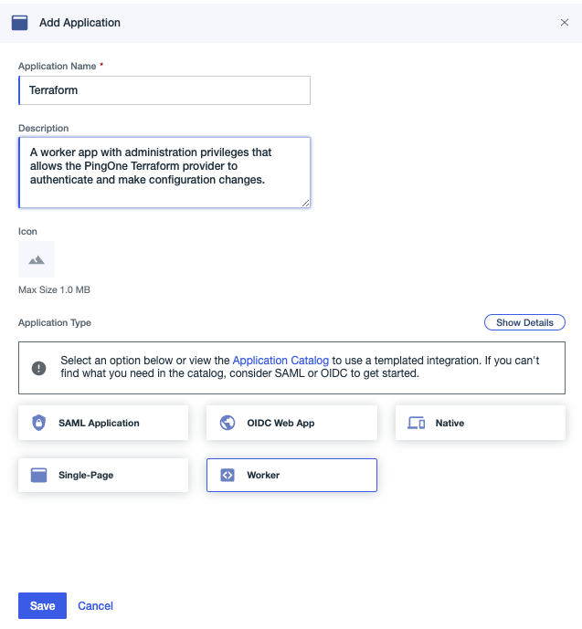
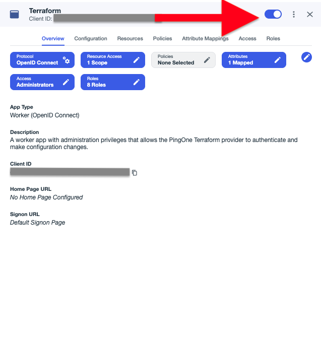
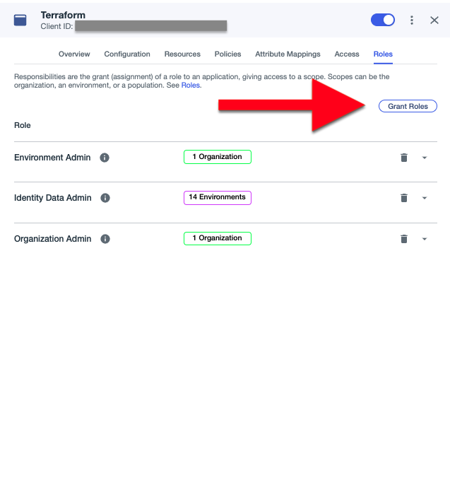
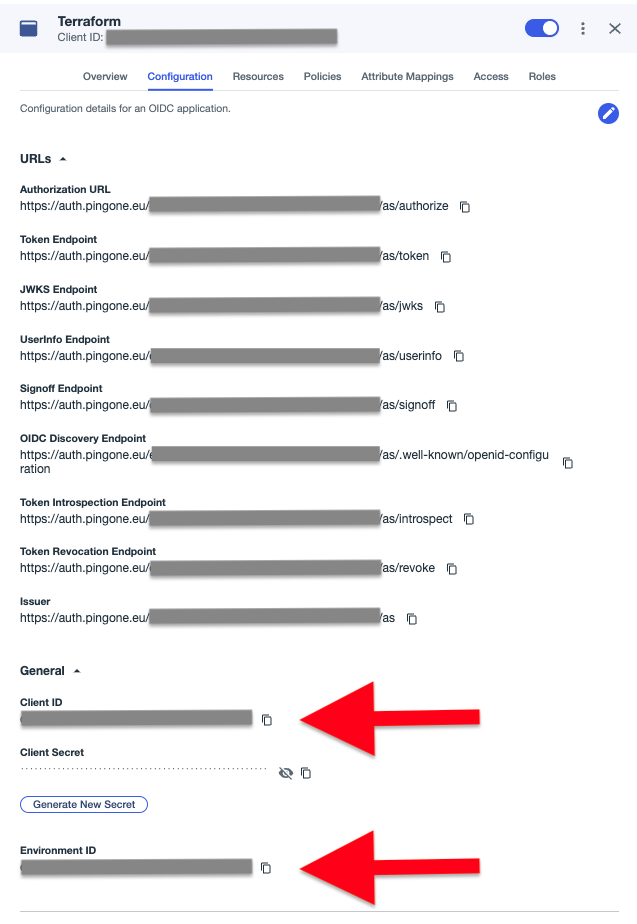
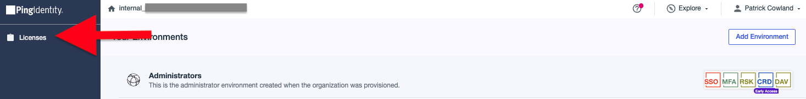
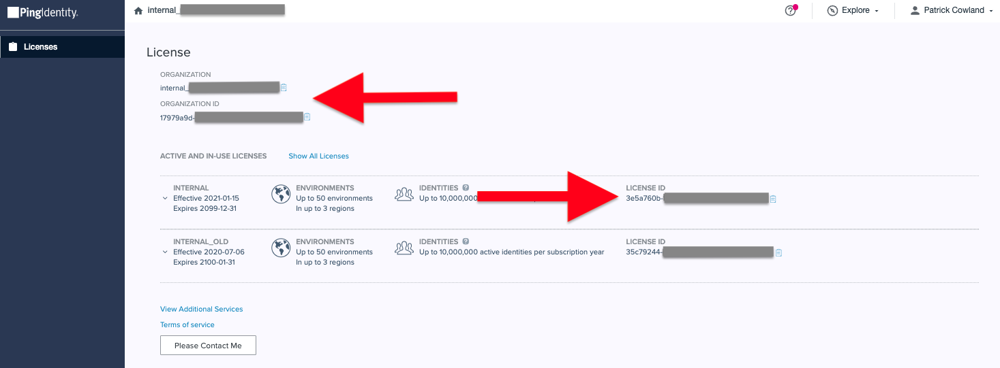

# Getting Started - PingOne

    
    
        <a class="assetlinks" href="https://registry.terraform.io/providers/pingidentity/pingone/latest" target=”_blank”>Registry</a>
    

## Requirements

* Terraform CLI 1.1+
* A licensed or trial PingOne cloud subscription - [Try Ping here](https://www.pingidentity.com/en/try-ping.html)
* Administrator access to the [PingOne Administration Console](https://docs.pingidentity.com/r/en-us/pingone/p1_access_admin_console)

## PingOne Subscription / Trial

To get started using the PingOne Terraform provider, first you'll need an active PingOne cloud subscription. Get instant access with a [PingOne trial account](https://www.pingidentity.com/en/try-ping.html), or read more about Ping Identity at [pingidentity.com](https://www.pingidentity.com)

!!! warning "PingOne DaVinci service license"
    If you're looking to manage PingOne DaVinci deployments with Terraform, note that the PingOne DaVinci service is not enabled by default in the PingOne Cloud Platform trial, or with licenses that do not explicitly include the DaVinci service.  Instructions for how to check PingOne DaVinci is enabled, or how to request access, can be found [here](https://pingidentity.github.io/terraform-docs/getting-started/davinci/#the-pingone-davinci-service-license).

## Configure PingOne for Terraform access

The following steps describe how to connect Terraform to your PingOne instance:

1. Log in to your **PingOne Administration Console**. On registration for a trial, a link will be sent to your provided email address.
2. Open the **Administrators** environment.  Note that any environment can be used.
3. Navigate to the **Applications** link.
    

      
Expand Screenshot

        
    

4. Add a new Application with the **+** icon.
    

      
Expand Screenshot

        
    

5. Set a name and an optional description.  Ensure that **Worker** is selected as the application type.
    

      
Expand Screenshot

        
    

6. Enable the application with the toggle switch.
    

      
Expand Screenshot

        
    

7. Click on the **Roles** tab, and set administrative roles accordingly.  Example roles to be able to create and manage environments and their configurations are shown in the below screenshot.  More information about role permissions can be found at the [PingOne Cloud Platform online documentation](https://docs.pingidentity.com/r/en-us/pingone/p1_c_roles).
    

      
Expand Screenshot

        
    

8. Click on the **Configuration** tab, expand the **General** section and extract the **Client ID**, **Client Secret** and **Environment ID** values. These are used to authenticate the provider to your PingOne tenant.
    

      
Expand Screenshot

        
    

9. Steps to configure the PingOne Terraform provider using these values can be found on the [Terraform Registry provider documentation](https://registry.terraform.io/providers/pingidentity/pingone/latest/docs).

## Finding Required IDs

There are tenant specific, unique IDs and name values that are required for the provider to operate.  The following sections show how to retrieve the relevant IDs.

### License ID, Organization ID and Organization Name

The license ID is required when creating an environment using the `pingone_environment`<a href="https://registry.terraform.io/providers/pingidentity/pingone/latest/docs/resources/environment" target="_blank">:octicons-link-external-16:</a> resource.  The organization ID/organization name can be used with the `pingone_organization`<a href="https://registry.terraform.io/providers/pingidentity/pingone/latest/docs/data-sources/organization" target="_blank">:octicons-link-external-16:</a> data source.  These values can be found with the following steps:

1. Log in to the **PingOne Administrators Console** using your unique console link.
2. Navigate to **Licenses**.
    

      
Expand Screenshot

        
    

3. Look for the relevant license (that is not an Admin license) and click the copy link icon to copy the ID.  The organization name and organization ID are also shown and can be copied.
    

      
Expand Screenshot

        
    

